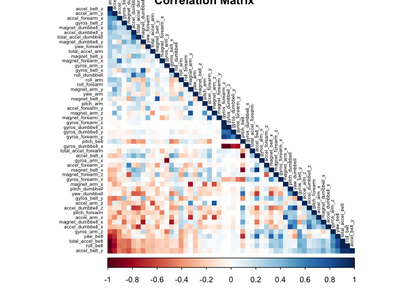
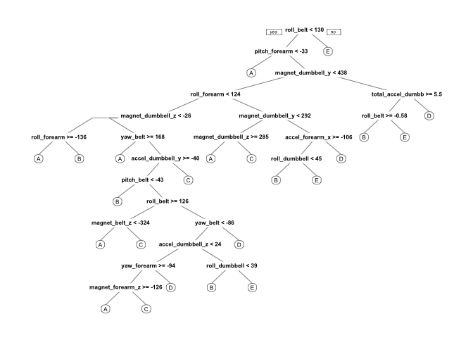
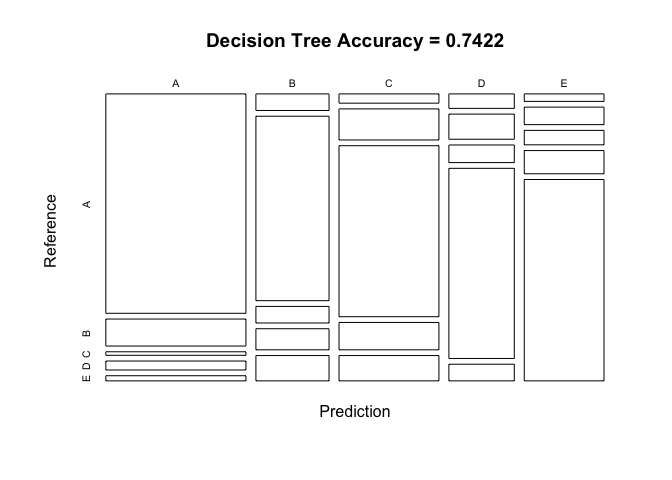

Practical Machine Learning Project
================
By Casey Jenkins

Introduction
------------

Using devices such as Jawbone Up, Nike FuelBand, and Fitbit it is now possible to collect a large amount of data about personal activity relatively inexpensively. These type of devices are part of the quantified self movement – a group of enthusiasts who take measurements about themselves regularly to improve their health, to find patterns in their behavior, or because they are tech geeks. One thing that people regularly do is quantify how much of a particular activity they do, but they rarely quantify how well they do it.

In this project, we will use data from accelerometers on the belt, forearm, arm, and dumbell of 6 participants to predict the manner in which they did the exercise.

Data Cleaning and Processing
----------------------------

``` r
library(caret)
```

    ## Loading required package: lattice

    ## Loading required package: ggplot2

``` r
library(knitr)
library(rpart)
library(rpart.plot)
library(randomForest)
```

    ## randomForest 4.6-12

    ## Type rfNews() to see new features/changes/bug fixes.

    ## 
    ## Attaching package: 'randomForest'

    ## The following object is masked from 'package:ggplot2':
    ## 
    ##     margin

``` r
library(corrplot)
```

    ## corrplot 0.84 loaded

``` r
set.seed(31257) # For reproducibile purpose
```

Download the data files
=======================

``` r
trainUrl <-"https://d396qusza40orc.cloudfront.net/predmachlearn/pml-training.csv"
testUrl <- "https://d396qusza40orc.cloudfront.net/predmachlearn/pml-testing.csv"
trainData <- "./data/pml-training.csv"
testData  <- "./data/pml-testing.csv"
if (!file.exists("./data")) {
  dir.create("./data")
}
if (!file.exists(trainData)) {
  download.file(trainUrl, destfile=trainData, method="curl")
}
if (!file.exists(testData)) {
  download.file(testUrl, destfile=testData, method="curl")
}
```

Now we can import the data into R as data
=========================================

``` r
trainData <- read.csv("./data/pml-training.csv")
testData <- read.csv("./data/pml-testing.csv")

class(trainData)
```

    ## [1] "data.frame"

``` r
dim(trainData)
```

    ## [1] 19622   160

``` r
class(testData)
```

    ## [1] "data.frame"

``` r
dim(testData)
```

    ## [1]  20 160

**The training data set contains 19622 observations and 160 variables, while the testing data set contains 20 observations and 160 variables. The "classe" variable in the training set is the outcome to predict.**

Cleaning the data
-----------------

Let's remove any NA missing values.

``` r
trainData <- trainData[, colSums(is.na(trainData)) == 0] 
testData <- testData[, colSums(is.na(testData)) == 0] 

dim(trainData)
```

    ## [1] 19622    93

``` r
dim(testData)
```

    ## [1] 20 60

We will need to remove some columns that do not relate to accelerometer data.
=============================================================================

``` r
classe <- trainData$classe
trainRemove <- grepl("^X|timestamp|window", names(trainData))
trainData <- trainData[, !trainRemove]
trainClean <- trainData[, sapply(trainData, is.numeric)]

trainClean$classe <- classe
testRemove <- grepl("^X|timestamp|window", names(testData))
testData <- testData[, !testRemove]
testClean <- testData[, sapply(testData, is.numeric)]
```

After cleaning the training data set it contains 19622 observations and 53 variables, while the testing data set contains 20 observations and 53 variables.

Slicing the data to the standard 70/30 split.
=============================================

``` r
inTrain <- createDataPartition(trainClean$classe, p=0.70, list=F)
trainData <- trainClean[inTrain, ]
testData <- trainClean[-inTrain, ]
```

A correlation among variables is analysed before moving on to modeling
----------------------------------------------------------------------

**Correlation Matrix Visualization**

``` r
corMatrix <- cor(trainData[, -length(names(trainData))])
corrplot(corMatrix, order = "FPC", method = "color", type = "lower", title = "Correlation Matrix",
         tl.cex = 0.5, tl.col = rgb(0, 0, 0))
```



**The highly correlated variables are shown in dark colors in the graph above.**

The Data Modeling
-----------------

1. Random Forest with 5 fold (Fit the Model)
============================================

``` r
# model fit
set.seed(31257) # For reproducibile purpose
controlrf <- trainControl(method="cv", 5)
rf <- train(classe ~ ., data=trainData, method="rf", trControl=controlrf, ntree=200) # Method Random Forest (rf)
rf
```

    ## Random Forest 
    ## 
    ## 13737 samples
    ##    52 predictor
    ##     5 classes: 'A', 'B', 'C', 'D', 'E' 
    ## 
    ## No pre-processing
    ## Resampling: Cross-Validated (5 fold) 
    ## Summary of sample sizes: 10989, 10990, 10990, 10990, 10989 
    ## Resampling results across tuning parameters:
    ## 
    ##   mtry  Accuracy   Kappa    
    ##    2    0.9893721  0.9865541
    ##   27    0.9902453  0.9876600
    ##   52    0.9850764  0.9811198
    ## 
    ## Accuracy was used to select the optimal model using the largest value.
    ## The final value used for the model was mtry = 27.

Then, we can estimate the performance of the model on the validation data set using a confusion matrix

``` r
# prediction on Test dataset
predictrf <- predict(rf, testData)
confusionMatrix(testData$classe, predictrf)
```

    ## Confusion Matrix and Statistics
    ## 
    ##           Reference
    ## Prediction    A    B    C    D    E
    ##          A 1672    1    1    0    0
    ##          B    6 1126    4    3    0
    ##          C    0    6 1016    4    0
    ##          D    0    0   11  951    2
    ##          E    0    0    0    3 1079
    ## 
    ## Overall Statistics
    ##                                          
    ##                Accuracy : 0.993          
    ##                  95% CI : (0.9906, 0.995)
    ##     No Information Rate : 0.2851         
    ##     P-Value [Acc > NIR] : < 2.2e-16      
    ##                                          
    ##                   Kappa : 0.9912         
    ##  Mcnemar's Test P-Value : NA             
    ## 
    ## Statistics by Class:
    ## 
    ##                      Class: A Class: B Class: C Class: D Class: E
    ## Sensitivity            0.9964   0.9938   0.9845   0.9896   0.9981
    ## Specificity            0.9995   0.9973   0.9979   0.9974   0.9994
    ## Pos Pred Value         0.9988   0.9886   0.9903   0.9865   0.9972
    ## Neg Pred Value         0.9986   0.9985   0.9967   0.9980   0.9996
    ## Prevalence             0.2851   0.1925   0.1754   0.1633   0.1837
    ## Detection Rate         0.2841   0.1913   0.1726   0.1616   0.1833
    ## Detection Prevalence   0.2845   0.1935   0.1743   0.1638   0.1839
    ## Balanced Accuracy      0.9980   0.9955   0.9912   0.9935   0.9988

Overall accuracy of Random Forest

``` r
accuracy <- postResample(predictrf, testData$classe)
accuracy
```

    ##  Accuracy     Kappa 
    ## 0.9930331 0.9911872

``` r
se <- 1 - as.numeric(confusionMatrix(testData$classe, predictrf)$overall[1])
se
```

    ## [1] 0.006966865

So, the estimated accuracy of the random forest model is 99.32% and the estimated sample error is 0.70%.

Predicting for Test Data Set
----------------------------

``` r
# prediction on Test dataset
result <- predict(rf, newdata=testData)
confMatRM <- confusionMatrix(result, testData$classe)
confMatRM
```

    ## Confusion Matrix and Statistics
    ## 
    ##           Reference
    ## Prediction    A    B    C    D    E
    ##          A 1672    6    0    0    0
    ##          B    1 1126    6    0    0
    ##          C    1    4 1016   10    0
    ##          D    0    3    4  952    3
    ##          E    0    0    0    2 1079
    ## 
    ## Overall Statistics
    ##                                           
    ##                Accuracy : 0.9932          
    ##                  95% CI : (0.9908, 0.9951)
    ##     No Information Rate : 0.2845          
    ##     P-Value [Acc > NIR] : < 2.2e-16       
    ##                                           
    ##                   Kappa : 0.9914          
    ##  Mcnemar's Test P-Value : NA              
    ## 
    ## Statistics by Class:
    ## 
    ##                      Class: A Class: B Class: C Class: D Class: E
    ## Sensitivity            0.9988   0.9886   0.9903   0.9876   0.9972
    ## Specificity            0.9986   0.9985   0.9969   0.9980   0.9996
    ## Pos Pred Value         0.9964   0.9938   0.9855   0.9896   0.9981
    ## Neg Pred Value         0.9995   0.9973   0.9979   0.9976   0.9994
    ## Prevalence             0.2845   0.1935   0.1743   0.1638   0.1839
    ## Detection Rate         0.2841   0.1913   0.1726   0.1618   0.1833
    ## Detection Prevalence   0.2851   0.1925   0.1752   0.1635   0.1837
    ## Balanced Accuracy      0.9987   0.9936   0.9936   0.9928   0.9984

**Plot matrix results**

``` r
plot(confMatRM$table, col = confMatRM$byClass, 
     main = paste("Random Forest Accuracy =",
                  round(confMatRM$overall['Accuracy'], 4)))
```


2. Decision Tree (Fit the Model)
--------------------------------

``` r
set.seed(31257) # For reproducibile purpose
treeModel <- rpart(classe ~ ., data=trainData, method="class")
prp(treeModel)
```



Predicting for Test Data Set
----------------------------

``` r
predictDT <- predict(treeModel, newdata=testData, type="class")
confMatDT <- confusionMatrix(predictDT, testData$classe)
confMatDT
```

    ## Confusion Matrix and Statistics
    ## 
    ##           Reference
    ## Prediction    A    B    C    D    E
    ##          A 1495  184   24   61   35
    ##          B   59  656   59   75   90
    ##          C   45  151  831  133  123
    ##          D   46   80   56  605   53
    ##          E   29   68   56   90  781
    ## 
    ## Overall Statistics
    ##                                           
    ##                Accuracy : 0.7422          
    ##                  95% CI : (0.7308, 0.7534)
    ##     No Information Rate : 0.2845          
    ##     P-Value [Acc > NIR] : < 2.2e-16       
    ##                                           
    ##                   Kappa : 0.6732          
    ##  Mcnemar's Test P-Value : < 2.2e-16       
    ## 
    ## Statistics by Class:
    ## 
    ##                      Class: A Class: B Class: C Class: D Class: E
    ## Sensitivity            0.8931   0.5759   0.8099   0.6276   0.7218
    ## Specificity            0.9278   0.9404   0.9070   0.9522   0.9494
    ## Pos Pred Value         0.8310   0.6986   0.6477   0.7202   0.7627
    ## Neg Pred Value         0.9562   0.9023   0.9576   0.9288   0.9381
    ## Prevalence             0.2845   0.1935   0.1743   0.1638   0.1839
    ## Detection Rate         0.2540   0.1115   0.1412   0.1028   0.1327
    ## Detection Prevalence   0.3057   0.1596   0.2180   0.1427   0.1740
    ## Balanced Accuracy      0.9104   0.7582   0.8585   0.7899   0.8356

**Plot matrix results**

``` r
plot(confMatDT$table, col = confMatDT$byClass, 
     main = paste("Decision Tree Accuracy =",
                  round(confMatDT$overall['Accuracy'], 4)))
```



**Applying the Selected Model to the Test Data**

**The accuracy of the 2 regression modeling methods below are:** **Random Forest : 0.993** **Decision Tree : 0.742**

The Random Forest model will be applied to predict the 20 quiz results (testing dataset cleaned) as shown below.

``` r
result <- predict(rf, testClean[, -length(names(testClean))])
result
```

    ##  [1] B A B A A E D B A A B C B A E E A B B B
    ## Levels: A B C D E
